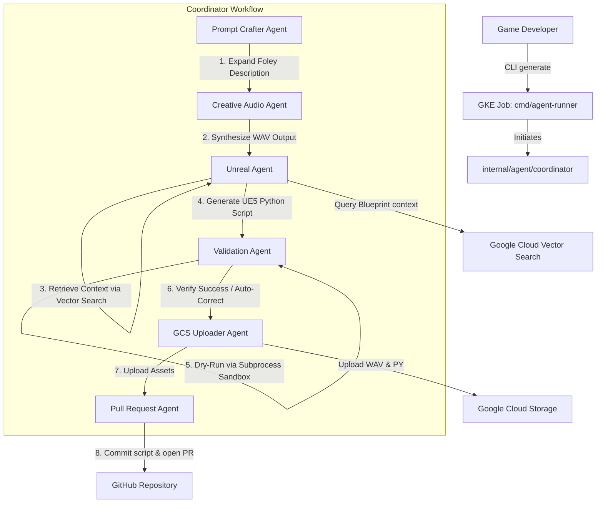

# Autonomous Game Assist CLI & Runner

An enterprise-grade, cloud-native AI agent suite built in Go using the Google ADK (Agent Development Kit) framework and Gemini 3.1 Pro, featuring automated asset synthesis, Level Blueprint semantic retrieval, process sandboxing, and automated GitHub Pull Request reviews.

## High-Level Architecture



## Prerequisites

1. **Google Cloud Project**: Ensure standard billing is enabled.
2. **Workload Identity Federation**: Enable inside your GKE cluster to run runner pods without mounting hardcoded credentials.
3. **API Services**:
   - Gemini Enterprise Agent Platform AI API
   - Cloud Storage API
   - Secret Manager API

## Local & Container Environment Configuration

Export the following environment variables:

```bash
# GCP project configurations
export GCP_PROJECT="your-gcp-project-id"
export GCP_LOCATION="us-central1"

# GCS storage delivery bucket
export GCS_BUCKET="autonomous-game-assist-deliverables-dev"

# Vector Search index configurations
export VECTOR_API_ENDPOINT="us-central1-aiplatform.googleapis.com"
export VECTOR_INDEX_ENDPOINT="projects/123456789/locations/us-central1/indexEndpoints/987654321"
export DEPLOYED_INDEX_ID="my_deployed_index_1"

# GitHub Integration Configurations (for PR Agent)
export GITHUB_TOKEN_SECRET_PATH="projects/your-gcp-project-id/secrets/github-token/versions/latest"
export GITHUB_OWNER="your-github-handle"
export GITHUB_REPO="your-repo-name"
export GITHUB_BASE_BRANCH="main"

# Optional secret version path for Gemini API Key (if not using ADC)
export GEMINI_API_KEY_SECRET_PATH="projects/your-gcp-project-id/secrets/gemini-key/versions/latest"
```

## Running the Binary Locally

Compile and run the coordinator synchronously:

```bash
# Build
go build -o agent-runner ./cmd/agent-runner

# Run
./agent-runner -prompt "Generate metal footstep sound links on trigger overlap"
```

## Local Developer CLI Tool (`game-assist`)

The platform is equipped with a local developer CLI (`cmd/game-assist`) to dispatch jobs to GKE and download the final synthesized deliverables.

### 1. Dispatching a generation job
Submit a natural language request to the GKE sandbox:
```bash
go run ./cmd/game-assist generate "generate metal footstep sound links on trigger overlap" --user "dev_ikogan"
```

### 2. Downloading synthesized assets
Once the job has completed and the GitHub PR has been opened, download the WAV files and generated python script locally using the session/job ID:
```bash
go run ./cmd/game-assist download --session "session-1713919121" --bucket "autonomous-game-assist-deliverables-dev" --dir "./deliverables"
```

## Docker Compilation

Build the multi-stage container:

```bash
docker build -t gcr.io/your-gcp-project-id/agent-runner:latest .
```

## CI/CD Pipeline (Cloud Build)

Run Cloud Build to automatically run checks, Trivy security scans, compile the image, and push it to Artifact Registry:

```bash
gcloud builds submit --config=cloudbuild.yaml \
  --substitutions=_REGISTRY_LOCATION="us-central1",_REPOSITORY_NAME="autonomous-game-assist"
```

## GitHub Actions CI/CD with Workload Identity Federation (WIF)

We utilize GitHub Actions to trigger Cloud Build pipelines securely without storing long-lived GCP service account keys. This is achieved using Workload Identity Federation (WIF).

### Setup Instructions

#### 1. Provision WIF Infrastructure
Apply the Terraform configuration in `deployments/terraform/` to create the Workload Identity Pool, Provider, and Service Account.

```bash
cd deployments/terraform
terraform init
# Ensure you provide your GKE cluster name to satisfy the variable
terraform apply -var="project_id=develop-491110" -var="gke_cluster_name=your-gke-cluster"
```

#### 2. Retrieve Terraform Outputs
After successful application, note the following outputs:
- `wif_provider_name`
- `github_actions_service_account_email`

#### 3. Configure GitHub Secrets
In your GitHub repository, navigate to **Settings > Secrets and variables > Actions** and add the following secrets:

| Secret Name | Value | Description |
| :--- | :--- | :--- |
| `GCP_PROJECT_ID` | `develop-491110` | Your GCP Project ID |
| `GCP_WIF_PROVIDER` | *Value from `wif_provider_name` output* | Full resource name of the WIF Provider |
| `GCP_SA_EMAIL` | *Value from `github_actions_service_account_email` output* | Email of the CI/CD Service Account |

### How it Works
The workflow in `.github/workflows/gcp-cloudbuild.yml` triggers on:
- Pushes to `main`
- Pull Requests targeting `main`

It authenticates to GCP using WIF and then submits the build to Cloud Build, executing all steps defined in `cloudbuild.yaml` (linting, testing, security scanning, and pushing the Docker image to Artifact Registry).
