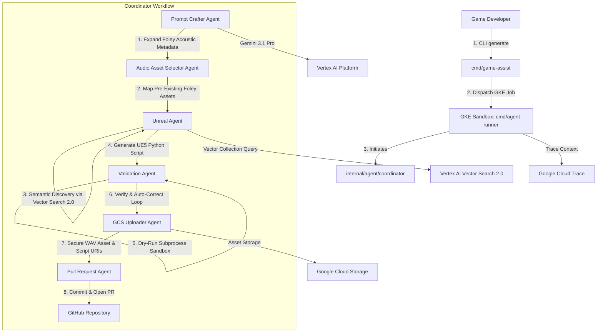

# Autonomous Game Assist CLI & Platform

An enterprise-grade, cloud-native AI agent suite built in Go using the Google ADK (Agent Development Kit) framework and **Gemini 3.1 Pro**, featuring automated Foley asset selection and acoustic metadata mapping, Level Blueprint semantic retrieval via **Vertex AI Vector Search 2.0**, gVisor-sandboxed script execution, and automated GitHub Pull Request reviews.

## High-Level Architecture



## Prerequisites & Required GCP Services

1. **Google Cloud Project**: Standard billing enabled with Workload Identity Federation (WIF) configured on GKE.
2. **GCP API Services**:
   - `aiplatform.googleapis.com` (Vertex AI Platform & Vector Search 2.0)
   - `storage.googleapis.com` (Google Cloud Storage)
   - `secretmanager.googleapis.com` (Secret Manager)
   - `cloudtrace.googleapis.com` (Google Cloud Trace)
3. **Go Runtime**: Go 1.23+ installed locally.

## Local & Container Environment Configuration

Export the following environment variables prior to running executables or deploying workloads:

```bash
# Core GCP project configurations
export GCP_PROJECT="your-gcp-project-id"
export GCP_LOCATION="us-central1"
export ENV="dev"

# Storage delivery bucket
export GCS_BUCKET="${GCP_PROJECT}-${ENV}-${GCP_LOCATION}-gameassist-bucket"

# Vertex AI Vector Search 2.0 Collection
export VECTOR_COLLECTION_ID="${GCP_PROJECT}-${ENV}-${GCP_LOCATION}-gameassist-collection"

# GitHub Integration Configurations (Secret Manager resource path)
export GITHUB_TOKEN_SECRET_PATH="projects/${GCP_PROJECT}/secrets/github-token/versions/latest"
export GITHUB_OWNER="your-github-handle"
export GITHUB_REPO="autonomous-game-assist-cli"
export GITHUB_BASE_BRANCH="main"
```

## Command-Line Tools (`cmd/`)

The repository provides three CLI executables built with Go:

### 1. Codebase Semantic Indexer (`cmd/vector-indexer`)
Scans target Unreal Engine codebase files (`Source/` and `Content/`), generates dense semantic embeddings with `gemini-embedding-2-preview`, and populates the Vector Search 2.0 Collection:

```bash
# Build indexer
go build -o vector-indexer ./cmd/vector-indexer

# Populate Vector Search Collection
./vector-indexer \
  --src "scratch/OpenWorldRPG" \
  --project "${GCP_PROJECT}" \
  --location "${GCP_LOCATION}" \
  --collection "${VECTOR_COLLECTION_ID}"
```

### 2. Local Developer CLI (`cmd/game-assist`)
Used by game developers to submit natural language integration requests to the GKE sandbox runtime and download finalized deliverables:

```bash
# Build CLI
go build -o game-assist ./cmd/game-assist

# Dispatch job to GKE sandbox
./game-assist generate "Integrate existing metal footstep sound effect on trigger overlap" \
  --user "dev_ikogan" \
  --image "${GCP_LOCATION}-docker.pkg.dev/${GCP_PROJECT}/autonomous-game-assist/agent-runner:latest"

# Download selected WAV sound asset and Python integration script
./game-assist download \
  --session "session-1713919121" \
  --bucket "${GCS_BUCKET}" \
  --dir "./deliverables"
```

### 3. Agent Runner Runtime (`cmd/agent-runner`)
The central execution engine triggered as a containerized job on GKE under gVisor isolation:

```bash
# Build binary locally for testing
go build -o agent-runner ./cmd/agent-runner

# Run directly (requires local ADC or active credentials)
./agent-runner -prompt "Integrate existing metal footstep sound effect on trigger overlap"
```

## Docker Compilation & Artifact Registry

Build the multi-stage production container image:

```bash
docker build -t ${GCP_LOCATION}-docker.pkg.dev/${GCP_PROJECT}/autonomous-game-assist/agent-runner:latest .
```

## CI/CD Pipeline (Cloud Build)

Submit builds to Cloud Build to automatically execute `go vet` linting, Trivy vulnerability scans, container vulnerability analysis, compile the multi-stage image, and push to Artifact Registry:

```bash
gcloud builds submit --config=cloudbuild.yaml \
  --substitutions=_REGISTRY_LOCATION="${GCP_LOCATION}",_REPOSITORY_NAME="autonomous-game-assist"
```

## GitHub Actions & Workload Identity Federation (WIF)

GitHub Actions workflow (`.github/workflows/gcp-cloudbuild.yml`) leverages keyless authentication via GCP Workload Identity Federation:

### Provisioning WIF Infrastructure (Terraform)
```bash
cd deployments/terraform
terraform init
terraform apply -var="project_id=${GCP_PROJECT}" -var="gke_cluster_name=your-gke-cluster"
```

### Required GitHub Repository Secrets
- `GCP_PROJECT_ID`: GCP Project ID
- `GCP_WIF_PROVIDER`: Full resource name of the Workload Identity Provider
- `GCP_SA_EMAIL`: Service Account Email configured for CI/CD

## Resource Governance & FinOps Compliance

All provisioned GCP infrastructure and Vector Search collections enforce mandatory FinOps tracking labels:

| Label | Description | Example |
| :--- | :--- | :--- |
| `environment` | Target deployment environment | `dev` / `staging` / `prod` |
| `cost-center` | FinOps accounting budget unit | `gaming-assist-ai` |
| `managed-by` | Provisioning engine or tool | `terraform` / `vector-indexer` |
