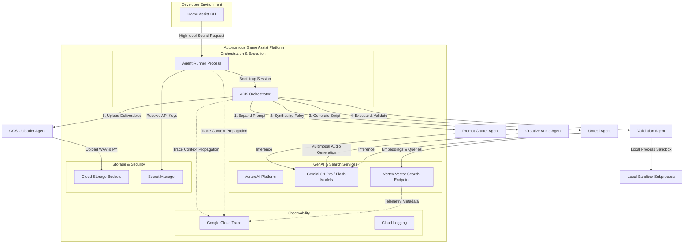

# Multi-Agent Architecture on Google Cloud Platform

This document provides a comprehensive overview of the enterprise-grade architecture of the Autonomous Game Assist platform, detailing how sequential agent pipelines cooperate, integrate with GCP-native resources, and leverage distributed tracing via OpenTelemetry and Google Cloud Trace.

---

## 1. Component Architecture

The platform consists of a structured CLI runner that bootstraps the central orchestrator and coordinates high-fidelity multimodal synthesis, semantic index retrieval, sandboxed validation, and secure delivery.

---

## 2. Core System Components & GCP Integration

### 2.1 Central Orchestration
* **Agent Development Kit (ADK)**: Acts as the runtime execution framework, orchestrating the execution order, managing sequential session states, and propagating context across agent execution boundaries.
* **Agent Runner**: Bootstrapped inside containerized execution runtimes (such as GKE Autopilot or Cloud Run), resolving system secrets from Secret Manager, configuring dependencies, and triggering execution sessions.

### 2.2 Large Language Models & Multimodal AI
* **Gemini 3.1 Pro**: Leveraged as the heavy reasoning core for the central coordinator, Unreal Agent, and Validation Agent to handle prompt structural expansion, Python code generation, and dry-run self-correction.
* **Gemini 3.1 Flash**: Used for lightweight, latency-critical subtasks.
* **Multimodal Audio Native Synthesis**: The Creative Audio Agent relies on Gemini's native `audio/wav` response MIME type and the `Aoede` voice preset to generate raw WAV game asset effects directly, avoiding separate text-to-speech pipelines.

### 2.3 Semantic Asset Discovery (Vertex Vector Search)
* **Vertex Vector Search (Matching Engine)**: Performs real-time, high-scale approximate nearest neighbor (ANN) semantic queries against pre-built asset collections.
* **Text Embeddings API**: Converts natural language queries into semantic dense vectors to enable precise matching inside Vector Search.

### 2.4 Sandboxed Local Subprocesses
* **Local Process Sandbox**: Isolates the dry-run execution of generated Unreal Engine Python and C++ scripts inside local subprocess environments, capturing exits, exit codes, compilation warnings, and standard error output without risking the host system.

### 2.5 Delivery & Storage (Cloud Storage)
* **Google Cloud Storage (GCS)**: Acts as the secure, enterprise game asset delivery bucket, storing final synthesized Foley WAV files and validated level automation scripts using session-keyed paths (`audio/foley_{session_id}.wav` and `scripts/unreal_assist_{session_id}.py`).

---

## 3. Observability & Distributed Tracing

To ensure full operational transparency and debugging capabilities, the platform implements comprehensive distributed tracing using **OpenTelemetry (OTel)** APIs and exports telemetry directly to **Google Cloud Trace**.

### 3.1 Context Propagation
* The platform uses standard OpenTelemetry context propagation (`propagation.TraceContext` and `propagation.Baggage`). 
* The root trace span (`game-assist-workflow`) is started by the CLI runner. 
* This context is passed to the ADK Orchestrator, which propagates the parent span context down to every sub-agent execution run and tool invocation.

### 3.2 OpenTelemetry Telemetry Mapping
* **ADK Instrumentation**: The framework automatically records agent execution latency, system inputs, LLM prompt lengths, token usages, and execution statuses.
* **Vector Search Tool Spans**: Explicit spans (`vector_search_tool`) are started for asset discovery, recording search queries and return limits as semantic search metadata attributes.
* **Sandbox Execution Spans**: Explicit spans (`sandbox_execution_tool`) capture code compilation and run outcome details, recording script language, subprocess execution statuses, and return codes.

---

## 4. Security & Cost Governance (Principle of Least Privilege)

* **Least Privilege Access Control (IAM)**: 
  * **Storage**: Service Account requires `roles/storage.objectCreator` to upload final deliverables.
  * **AI & Vector Search**: Requires `roles/aiplatform.user` to trigger LLM reasoning and vector index lookups.
  * **Secret Manager**: Requires `roles/secretmanager.secretAccessor` on target secrets.
  * **Telemetry**: Requires `roles/cloudtrace.agent` to export traces to Google Cloud Trace.
* **Workload Identity**: Avoids hardcoded credentials by mapping Kubernetes Service Accounts (KSA) directly to Google Service Accounts (GSA).
* **FinOps Alignment**: Emits custom tracking labels (`environment`, `owner`, `cost-center`, and `managed-by`) to allow precise GCP billing analytics.
