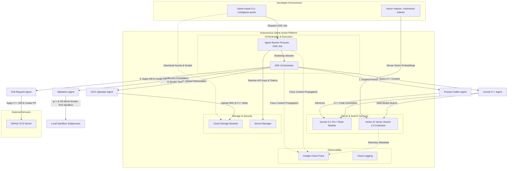

# Multi-Agent Architecture on Google Cloud Platform

This document provides a comprehensive overview of the enterprise-grade architecture of the Autonomous Game Assist platform, detailing how sequential agent pipelines cooperate, integrate with GCP-native resources, and leverage distributed tracing via OpenTelemetry and Google Cloud Trace.

---

## 1. Component Architecture

The platform consists of a structured CLI suite that populates semantic search collections, dispatches execution jobs to isolated GKE sandboxes, and coordinates high-fidelity Foley audio selection, Blueprint retrieval, sandboxed Python code validation, and pull request delivery.

---

## 2. Core System Components & GCP Integration

### 2.1 Central Orchestration
* **Agent Development Kit (ADK)**: Framework managing sequential execution flow, intermediate state variables, and context propagation across agent boundaries.
* **Agent Runner (`cmd/agent-runner`)**: Bootstrapped inside containerized GKE gVisor runtimes, resolving secrets from Secret Manager, initializing dependencies, and executing orchestration workflows.

### 2.2 Large Language Models
* **Gemini 3.1 Pro**: Core reasoning engine driving prompt expansion, Unreal Engine Python script generation, vector query synthesis, and sandbox dry-run auto-correction.
* **Gemini 3.1 Flash**: Deployed for lightweight, latency-critical operations.

### 2.2 Large Language Models & Multimodal AI
* **Gemini 3.1 Pro**: Leveraged as the heavy reasoning core for the central coordinator, Unreal Agent, and Validation Agent to handle prompt structural expansion, Python code generation, and dry-run self-correction.
* **Gemini 3.1 Flash**: Used for lightweight, latency-critical subtasks.
* **Vector Search 2.0**: Used as a multi-modal semantic search layer

### 2.4 Pre-Existing Foley Asset Selection & Management
* **Audio Asset Selector**: Resolves pre-existing Foley sound effects from target storage repositories, mapping expanded acoustic metadata (materials, speeds, dynamics) to appropriate sound assets without live audio generation.

### 2.5 Sandboxed Local Subprocesses
* **Subprocess Sandbox**: Dry-runs generated Unreal Engine 5 Python automation scripts in isolated sub-processes, capturing compilation errors, exit codes, and diagnostics for iterative auto-correction.

### 2.6 Delivery & Storage (Cloud Storage)
* **Google Cloud Storage (GCS)**: Stores selected Foley sound assets and validated Python automation scripts under session-keyed paths (`audio/foley_{session_id}.wav` and `scripts/unreal_assist_{session_id}.py`).

### 2.7 Pull Request Agent (Human-in-the-Loop Review)
* **GitHub Pull Request Integration**: Authenticates via GitHub Personal Access Tokens stored in Secret Manager, clones repository branches, commits integration scripts, and opens PRs containing direct asset download links.

---

## 3. Observability & Distributed Tracing

* **OpenTelemetry Context Propagation**: Propagates `TraceContext` and `Baggage` across agent steps under root span `game-assist-workflow`.
* **Google Cloud Trace**: Exports telemetry spans for agent latencies, vector retrieval queries, and sandbox validation runs.

---

## 4. Resource Governance & FinOps Compliance

All provisioned infrastructure and vector collections enforce standardized labels:

| Label | Description | Allowed Values / Pattern |
| :--- | :--- | :--- |
| `environment` | Deployment stage | `dev`, `staging`, `prod` |
| `owner` | Responsible user or team handle | e.g. `ikogan` |
| `cost-center` | Accounting budget allocation | e.g. `gaming-assist-ai` |
| `managed-by` | IaC or automation tool | `terraform`, `vector-indexer` |
