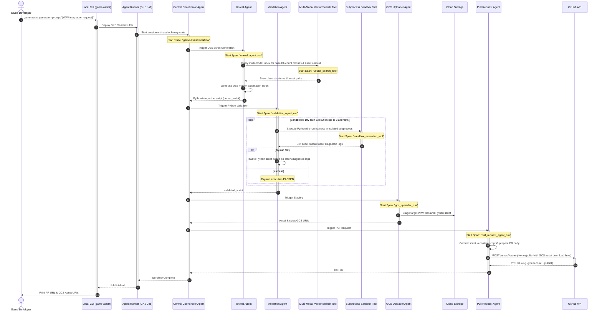

# Multi-Agent Sequential Workflow

This document outlines the step-by-step sequential processing workflow of the Autonomous Game Assist CLI system on Google Cloud Platform.

---

## 1. Core Execution Flow

When a game developer triggers the CLI with a high-level request (e.g., `./game-assist generate "Integrate existing metal footstep sound effect on trigger overlap"`), the Central Coordinator orchestrates four cooperative agent steps in sequence to query Blueprint indexes, generate and validate Python integration scripts, stage GCS assets, and deliver PRs.

---

## 2. Sub-Agent Operations and State Transitions

### 2.1 Central Coordinator Agent
* **Type**: Orchestrator (`sequentialagent`)
* **State Inputs**: Developer prompt from `game-assist`, `audio_binary` pre-populated in session state by `agent-runner`.
* **Responsibility**: Manages session variables, coordinates 4 sub-agent executions, and propagates OpenTelemetry trace contexts.

### 2.2 Unreal Agent
* **Type**: Integration Coder (`llmagent` using Gemini 3.1 Pro: `gemini-3.1-pro-preview`)
* **Tool**: `vector_search`
* **State Output**: `unreal_script` (Python string)
* **Instruction**: Queries **Vertex AI Vector Search 2.0 Collections** to discover target Level Blueprints and actor classes, generating a Python script to link the selected Foley sound asset to UE5 trigger volumes.

### 2.3 Validation Agent & Auto-Correction Loop
* **Type**: Quality Assurance Coder (`llmagent` using Gemini 3.1 Pro: `gemini-3.1-pro-preview`)
* **Tool**: `sandbox_tool`
* **State Input**: `unreal_script`
* **State Output**: `validated_script` (Python string)
* **Loop Logic**:
  1. Executes script in isolated Python subprocess sandbox.
  2. Evaluates exit status and `stderr`.
  3. Rewrites script upon syntax or API errors (maximum 3 iterations).

### 2.4 GCS Uploader Agent
* **Type**: Storage System Agent (`coordinator.gcsUploader`)
* **State Inputs**: `audio_binary`, `validated_script`
* **State Output**: `gs://` delivery paths (`audio/foley_{session_id}.wav`, `scripts/unreal_assist_{session_id}.py`)
* **Instruction**: Uploads validated script and Foley audio asset under session-keyed storage locations.

### 2.5 Pull Request Agent
* **Type**: Git Integration Agent (`pr.Agent`)
* **State Inputs**: `validated_script`, `audio_gcs_uri`, `script_gcs_uri`, `prompt`
* **State Output**: GitHub Pull Request URL
* **Instruction**: Clones repository, creates feature branch `foley-assist-{session_id}`, commits the script to `content/scripts/`, and dispatches GitHub API call to open PR with direct GCS download links.
