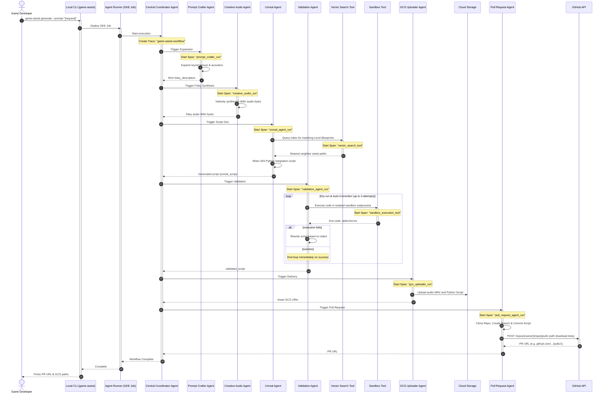

# Multi-Agent Sequential Workflow

This document outlines the step-by-step sequential processing workflow of the Autonomous Game Assist CLI system on Google Cloud Platform.

---

## 1. Core Execution Flow

When a game developer triggers the CLI with a high-level request (e.g., `game-assist --prompt "footsteps on metal floor"`), the Central Coordinator orchestrates five cooperative agents in a strict sequential order to expand, synthesize, discover, validate, and deliver resources.

---

## 2. Sub-Agent Operations and State Transitions

### 2.1 Central Coordinator Agent
* **Type**: Orchestrator (`sequentialagent`)
* **State Inputs**: The raw developer prompt from the command-line interface.
* **Responsibility**: Initializes individual sub-agents and executes them in the defined sequence, passing the active session state containing intermediate variables from one agent to the next.

### 2.2 Prompt Crafter Agent
* **Type**: Reasoner (`llmagent` using Gemini 3.1 Pro)
* **State Output**: `foley_description` (string)
* **Instruction Outline**: Expands simple prompts into highly descriptive paragraphs containing physical properties, materials (e.g., iron plates, sand, foliage), speeds, impact forces, reverberation, and acoustics to maximize Gemini's foley synthesis capability.

### 2.3 Creative Audio Agent
* **Type**: Multimodal Generator (`llmagent` using Gemini 3.1 Pro)
* **State Input**: `foley_description`
* **State Output**: `audio_binary` (binary WAV bytes)
* **Synthesis Detail**: Instructs Gemini to output natively formatted WAV bytes corresponding to the expanded foley dynamics. Avoids secondary external sound libraries.

### 2.4 Unreal Agent
* **Type**: Semantic Integration Coder (`llmagent` using Gemini 3.1 Pro)
* **Equipped Tool**: `vector_search`
* **State Output**: `unreal_script` (raw Python code string)
* **Discovery Detail**: Uses the Vector Search tool to query existing game levels, character actor class names, and blueprint locations, then generates standard Python scripts to programmatically link the synthesized foley audio file into active UE5 levels.

### 2.5 Validation Agent & Sandbox Self-Correction Loop
* **Type**: Quality Assurance Coder (`llmagent` using Gemini 3.1 Pro)
* **Equipped Tool**: `sandbox_tool`
* **State Input**: `unreal_script`
* **State Output**: `validated_script` (raw validated Python code string)
* **The Self-Correction Loop**:
  1. Receives raw script. Calls the isolated `sandbox_tool` subprocess runner to validate it.
  2. Inspects exit status and error diagnostics (`stderr`).
  3. If compilation or runtime failures occur, the agent is instructed to rewrite the script, fixing the syntax or incorrect level APIs.
  4. Re-runs validation. The loop runs up to a maximum of 3 times. If still unresolved, it marks the workflow state as `VALIDATION_FAILED`.

### 2.6 GCS Uploader Agent
* **Type**: Custom System Agent (`coordinator.gcsUploader`)
* **State Inputs**: `audio_binary`, `validated_script`
* **Delivery Output**: gs:// URL paths
* **Storage Detail**: Generates UUID/session-keyed storage paths, executes secure uploads to Cloud Storage, and emits the final delivery receipt.

### 2.7 Pull Request Agent
* **Type**: Custom Git/API Agent (`pr.Agent` using GitHub OIDC credential authentication)
* **State Inputs**: `validated_script` (string), `audio_gcs_uri` (string), `script_gcs_uri` (string), `prompt` (string), `foley_description` (string)
* **State Output**: Dynamic Pull Request landing URL.
* **Process Details**:
  1. Fetches authorized personal access token from Google Secret Manager.
  2. Initiates ephemeral `/tmp` workspace clone.
  3. Creates a target branch named `foley-assist-{session_id}`.
  4. Saves the final validated Python script under `content/scripts/unreal_assist_{session_id}.py`.
  5. Commits and pushes changes to `origin`.
  6. Forms a rich markdown review ticket linking both direct GCS synthesized audio and script review locations.
  7. Dispatches a GitHub Pulls API request to open the PR for reviewer inspection.
